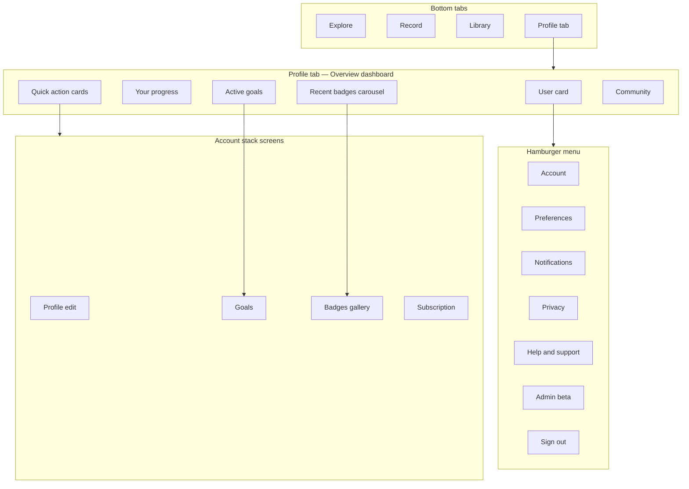

# Mobile User UI — Delivery Roadmap

**Parent roadmap:** [`UserMenuRoadmap.md`](UserMenuRoadmap.md)  
**Requirements source:** [`usermenu.md`](usermenu.md)  
**Badge parity:** [`badgeSystemRoadmap.md`](badgeSystemRoadmap.md) §14  
**Visual reference:** Mobile profile dashboard mockup (user card, progress stats, active goals, badge carousel, quick-action cards, hamburger for low-frequency settings)  
**Status:** Phase M5 complete (subscription, help, deep links, tablet overview)  
**Last updated:** June 2026

---

## Overview

On **web**, the account hub works as a **sidebar + overview panel** inside the header dropdown — horizontal space supports browsing Profile, Goals, Badges, and Preferences without leaving the map.

On **mobile**, copying that pattern as a long settings list produces an uninspiring screen. Users open Profile to see **how they are doing**, not to tune GPS permissions.

**Design intent:** Make the **Profile bottom tab** a **motivating overview dashboard** (stats, goals, badges, membership) and move configuration into a **hamburger menu** and **quick-action cards** that push to focused secondary screens.

| Layer | Owner | Responsibility |
|-------|--------|----------------|
| **Clerk** | Auth | Avatar, sign-in/out, sessions |
| **Convex** | Product data | Stats, goals, badges, preferences, subscription display |
| **Mobile UI** | Expo app | Dashboard layout, carousels, native navigation, shine animations |

### Naming recommendation

| Surface | Suggested label | Rationale |
|---------|-----------------|-----------|
| Bottom tab | **Profile** | Familiar iOS/Android convention; users know where to tap |
| Screen title (header) | **My Rambleio** or **My Journey** | Reflects stats + goals + achievements, not just “settings” |
| Quick-action card | **Profile** | Leads to edit screen (name, avatar, email) |

**Recommendation:** Tab stays **Profile**; in-screen title uses **My Rambleio** until user research picks a favourite.

---

## Current state (baseline)

| Area | Mobile today (`app/(tabs)/profile.tsx`) | Web today (shipped) |
|------|----------------------------------------|---------------------|
| Profile tab | Accordion settings: Preferences, Permissions, Developer, Diagnostics | Avatar dropdown → **Overview** default + sidebar sections |
| Avatar | Initial letter only | Clerk `imageUrl` + upload |
| Lifetime stats | Not shown | `users.getLifetimeStats` on overview |
| Goals | Not implemented | `userGoals.listRecentForOverview` + full goals UI |
| Badges | Not implemented | `badges.listRecentUnlocked` + gallery + shine effects |
| Subscription | Not shown | Beta plan card |
| Preferences | Local SQLite (`useUserPreferences`) | Convex `users.preferences` |
| Sign out | Prominent on main profile screen | Footer / hamburger |

### Problem

The Profile tab is effectively a **configuration dump**. High-value, return-worthy content (progress, goals, badges) is missing, while low-frequency items (permissions, diagnostics) compete for attention at the top level.

---

## Target navigation

Bottom tabs **unchanged**:

```
Explore  |  Record  |  Library  |  Profile
```

Tapping **Profile** opens the **overview dashboard** — not a settings list.



### Header chrome

```
┌───────────────────────┐
│ ☰                ⚙️   │  ← hamburger (account menu) | gear (Preferences shortcut)
├───────────────────────┤
```

| Control | Action |
|---------|--------|
| **☰ Hamburger** | Slide-over or bottom sheet with low-frequency account items |
| **⚙️ Gear** | Push directly to **Preferences** (most common “settings” task) |

### Settings screens & entry points

Nothing from today’s Profile tab is removed — it is **relocated** into focused full screens. The overview dashboard does not duplicate accordion content.

| Current `profile.tsx` accordion | New independent screen | Primary entry |
|--------------------------------|------------------------|---------------|
| **Preferences** (distance unit, body weight) | `/account/preferences` | **⚙️ Cog** (header shortcut) |
| **Permissions** (location, pedometer, Health Connect) | `/account/permissions` | **☰ Hamburger** → Permissions |
| **Developer Settings** (sync from cloud, route colours) | `/account/developer` | **☰ Hamburger** → Developer *(beta/dev builds)* |
| **Diagnostics** (`DiagnosticsPanel`) | `/account/diagnostics` | **☰ Hamburger** → Diagnostics *(nested under Developer, or sibling row)* |
| Sign out | — | **☰ Hamburger** only |
| App version | `/account/help` footer | **☰ Hamburger** → Help & Support |

**Cog vs burger rule of thumb:**

| Entry | Use for |
|-------|---------|
| **⚙️ Cog** | Product **preferences** users change occasionally (units, weight, display defaults) — same mental model as “settings” on other apps |
| **☰ Hamburger** | **Account**, **permissions**, **developer/diagnostics**, help, admin, sign out — infrequent or technical |

Preferences may also appear in the hamburger as a secondary link for discoverability, but the cog is the primary shortcut.

Each relocated screen is a **standalone stack route** with its own header and back navigation — not an accordion on the dashboard. Existing UI (`PermissionRow`, `RouteColourPicker`, `DiagnosticsPanel`, preference segments) moves into these screens with minimal redesign.

---

## Profile overview — section hierarchy

Scroll order (top → bottom). **Do not reorder** — matches mockup and web overview priority.

```
1. User card
2. Your progress
3. Active goals
4. Recent badges
5. Quick action cards
6. Community
```

Everything else lives in the **hamburger menu** or **account stack**.

### 1. User card

| Element | Source / behaviour |
|---------|-------------------|
| Avatar | Clerk `user.imageUrl`; initials fallback; tap → Profile edit screen |
| Display name | Clerk `fullName` / Convex `users.name` |
| Beta badge | Same copy as web `BetaBadge` — “Beta Member” |
| Subtext | “Thank you for being part of our journey.” |
| Background | Soft gradient + subtle mountain silhouette (match web `account-menu-overview`) |

**Not on card:** Sign out, permissions, version number.

### 2. Your progress

Four equal stat tiles in one row (wrap to 2×2 on very narrow widths if needed):

| Stat | Convex API | Formatting |
|------|------------|------------|
| Walks | `users.getLifetimeStats` → `walkCount` | Integer |
| Total distance | `totalDistanceMetres` | Respect `preferences.distanceUnit` |
| Total ascent | `totalElevationGainMetres` | Respect `preferences.elevationUnit` |
| Moving time | `totalMovingTimeSeconds` | `1.7 h` style |

Header row: **Your progress** + **View all stats** link (optional v1 — can push to a future stats detail screen or Library/Sessions tab).

Reuse formatting helpers from web (`formatDistanceMetresShort`, `formatElevation`, `formatMovingTimeTotal`) — port to `lib/format-units` in mobile or shared package.

### 3. Active goals

**Elevated on mobile** — full-width cards, not compact sidebar rows.

| Element | Detail |
|---------|--------|
| API | `userGoals.listRecentForOverview` (`limit: 2` on mobile) |
| Card content | Title, subtitle/type, **Day N** chip for open-ended challenges, progress bar, `current / target` with unit |
| Empty state | “No active goals” + **Create one** CTA |
| Header | **Active goals** + **View all goals** → `/account/goals` |

Match web `GoalProgressBar` visual language (coloured bar, challenge day pill).

### 4. Recent badges

**Horizontal carousel** — not a 5-column grid (insufficient width).

| Element | Detail |
|---------|--------|
| API | `badges.listRecentUnlocked` (`limit: 8`); `badges.getUiSettings` for shine style |
| Layout | `FlatList` horizontal, `showsHorizontalScrollIndicator={false}`, snap optional |
| Badge cell | Native hex component — earned state, checkmark, **NEW** pill |
| Shine | Port web shine styles (`soft_sweep` … `bright_flash`) via Reanimated + gradient overlay or Skia |
| Tap badge | Push badge detail modal (confetti on `isNew` — port `fireBadgeConfetti` using `react-native-confetti-cannon` or similar) |
| Mark seen | `badges.markBadgeSeen` on detail open |
| Header | **Recent badges** + **View all** → `/account/badges` |
| Pagination dots | Optional page indicator when >4 visible |

In-progress badges on full gallery use **bottom-fill hex** (grey top, colour fill from progress %) — same semantics as web `BadgeHex`.

### 5. Quick action cards

**2×2 grid** of thumb-friendly tappable cards (not list rows).

| Card | Icon colour (mockup) | Destination |
|------|---------------------|-------------|
| **Profile** | Teal | `/account/profile` — name, avatar, email |
| **Goals** | Orange | `/account/goals` |
| **Badges** | Purple | `/account/badges` |
| **Premium** | Blue | `/account/subscription` |

Each card: icon, title, one-line subtitle (“View & edit”, “Track progress”, etc.).

### 6. Community

Grouped list section (lower priority, below fold):

| Row | Status | Destination |
|-----|--------|-------------|
| **Friends** | Coming soon | Placeholder sheet |
| **Sharing** | Coming soon | `/account/sharing` placeholder |

Matches web sharing placeholder — no backend required for v1.

---

## Hamburger menu

Low-frequency account management. Opens from **☰** as a slide-over drawer or modal list.

```
☰ Menu
─────────────────
Account
Permissions
Developer              ← beta/dev; contains sync + route colours
Diagnostics            ← or nested under Developer
─────────────────
Notifications          ← placeholder v1
Privacy                ← placeholder v1
─────────────────
Help & Support
─────────────────
Admin                  ← visible only if users.isAdmin
Sign Out
```

| Item | Destination | Notes |
|------|-------------|-------|
| **Account** | `/account/settings` | Email, delete account placeholders, legal links |
| **Permissions** | `/account/permissions` | Location, pedometer, Health Connect — **today’s Permissions accordion** |
| **Developer** | `/account/developer` | Sync from cloud, route colours — **today’s Developer Settings accordion** |
| **Diagnostics** | `/account/diagnostics` | **Today’s Diagnostics accordion**; may be nested under Developer |
| **Notifications** | Placeholder | Future push prefs |
| **Privacy** | Placeholder | Data export, visibility |
| **Help & Support** | `/account/help` | FAQ, contact, **app version** |
| **Admin** | `/admin` or web-only link | Beta admin tools if exposed |
| **Sign out** | Clerk `signOut()` | Destructive confirm (existing pattern) |

**Not in hamburger:** **Preferences** — use **⚙️ cog** instead (see table above). Optional duplicate link in hamburger if user testing shows confusion.

---

## Account stack (secondary screens)

Introduce `app/account/` as a **stack navigator** pushed from quick actions and hamburger.

```
app/
  account/
    _layout.tsx          Stack
    profile.tsx          Edit profile + avatar upload
    preferences.tsx      Units, weight (Convex)
    permissions.tsx      Location, pedometer, Health Connect
    goals/
      index.tsx          Goal list
      new.tsx            Create goal
      [id].tsx           Goal detail (optional)
    badges/
      index.tsx          Full gallery (filters, recalculate)
      [key].tsx          Badge detail modal (optional inline)
    subscription.tsx     Beta plan card
    sharing.tsx          Coming soon
    help.tsx             Support links
    settings.tsx         Account management
    developer.tsx        Dev-only
    diagnostics.tsx      Logs, sync
```

Profile tab (`app/(tabs)/profile.tsx`) becomes a thin wrapper that renders `OverviewDashboard` — or re-exports the same component.

---

## Convex API reuse (no duplicate logic)

Mobile is **display + navigation only**; all product rules stay server-side.

| API | Overview use |
|-----|----------------|
| `users.getLifetimeStats` | Progress row |
| `users.getCurrentUser` / `upsertCurrentUser` | Profile strip, preferences |
| `userGoals.listRecentForOverview` | Active goals section |
| `userGoals.list` / `create` / `archive` | Goals stack |
| `badges.listRecentUnlocked` | Badge carousel |
| `badges.getGalleryForCurrentUser` | Full badges screen |
| `badges.getUiSettings` | Shine animation variant |
| `badges.markBadgeSeen` | Clear NEW on view |
| `badges.recalculateForCurrentUser` | Backfill historic walks |
| `users.recordAvatarUpdated` | After Clerk avatar upload |

Badge **evaluation** already runs on `walks.finalizeSync`, goals, profile events — mobile does not re-implement evaluators.

---

## Component map (mobile — planned)

| Path | Role |
|------|------|
| `app/(tabs)/profile.tsx` | Overview dashboard (rewrite) |
| `components/account/overview-dashboard.tsx` | Main scroll layout |
| `components/account/user-card.tsx` | Header card + beta badge |
| `components/account/progress-stats-row.tsx` | Four stat tiles |
| `components/account/active-goals-section.tsx` | Goal cards |
| `components/account/recent-badges-carousel.tsx` | Horizontal hex list |
| `components/account/quick-action-grid.tsx` | 2×2 cards |
| `components/account/account-hamburger-menu.tsx` | Drawer / sheet |
| `components/badges/badge-hex.native.tsx` | Hex shape, fill, shine, NEW |
| `components/badges/badge-detail-sheet.tsx` | Detail + confetti |
| `app/account/*` | Stack screens listed above |

Port or share logic from web:

| Web reference | Mobile port |
|---------------|-------------|
| `account-menu-overview.tsx` | `overview-dashboard.tsx` |
| `badge-hex.tsx` + `globals.css` shine | `badge-hex.native.tsx` + Reanimated |
| `badge-gallery.tsx` | `app/account/badges/index.tsx` |
| `goal-progress-bar.tsx` | `components/account/goal-progress-bar.tsx` |

---

## Delivery phases

Phases supersede the generic mobile section in [`UserMenuRoadmap.md`](UserMenuRoadmap.md) with this **dashboard-first** structure.

### Phase M1 — Overview dashboard shell (1 week) ✅

**Depends on:** Web account hub shipped (Phases 1–4+)

| Deliverable | Detail | Status |
|-------------|--------|--------|
| Rewrite `profile.tsx` | Overview layout with user card + progress stats | ✅ |
| Header | ☰ + ⚙️ chrome, title “My Rambleio” | ✅ |
| Convex stats | Wire `getLifetimeStats`; loading skeletons | ✅ |
| Clerk avatar | Show `imageUrl` on user card | ✅ |
| Hamburger v1 | Account, Permissions, Developer, Diagnostics, Help, Sign out | ✅ |
| Settings stack | `app/account/*` — Preferences (cog), relocated accordions | ✅ |
| Remove | Sign out + accordions from main scroll | ✅ |

**Exit criteria:** Profile tab feels like a dashboard; no accordion settings on first screen.

**Shipped files (mobile repo root):** `app/(tabs)/profile.tsx`, `app/account/*`, `components/account/overview-dashboard.tsx`, `dashboard-header.tsx`, `user-card.tsx`, `progress-stats-section.tsx`, `account-hamburger-menu.tsx`, `components/account/settings/*`.

---

### Phase M2 — Goals & badges on overview (1–2 weeks) ✅

**Depends on:** Web Phase 6–7; [`badgeSystemRoadmap.md`](badgeSystemRoadmap.md) Phase 7 complete

| Deliverable | Detail | Status |
|-------------|--------|--------|
| Active goals section | `listRecentForOverview`, progress bars, Day N chip | ✅ |
| Badge carousel | Horizontal `FlatList`, hex cells, NEW pill + shine | ✅ |
| Account stack | `/account/goals`, `/account/badges`, profile, subscription, sharing | ✅ |
| Quick action grid | 2×2 cards wired to stack | ✅ |
| Badge detail sheet | Tap badge → bottom sheet; `markBadgeSeen` | ✅ |
| Community section | Friends / Sharing placeholders | ✅ |
| Full goals screen | Create, archive, active/completed lists | ✅ |
| Full badges gallery | Category grids, recalculate | ✅ |

**Exit criteria:** Goals and badges are the visual centrepiece of Profile tab; parity with web overview content.

**Shipped files:** `active-goals-section.tsx`, `recent-badges-carousel.tsx`, `quick-action-grid.tsx`, `community-section.tsx`, `goals-screen-content.tsx`, `badges-gallery-screen.tsx`, `badge-hex.tsx`, `badge-detail-sheet.tsx`, `app/account/goals`, `app/account/badges`, etc.

---

### Phase M3 — Preferences sync & profile edit (3–5 days) ✅

**Depends on:** Web preferences API stable

| Deliverable | Detail | Status |
|-------------|--------|--------|
| `/account/profile` | Avatar upload (`expo-image-picker` → `setProfileImage`); `recordAvatarUpdated` | ✅ |
| `/account/preferences` | Read/write Convex preferences; migrate off local-only units | ✅ |
| Gear icon | Opens preferences | ✅ |
| Permissions screen | Move location / pedometer / Health Connect rows | ✅ (M1) |
| Conflict policy | Convex wins for product prefs; SecureStore for device-only | ✅ |

**Shipped files:** `hooks/use-display-preferences.ts`, `components/account/profile-screen-content.tsx`, `preferences-screen-content.tsx`, `lib/rambleio-avatars.ts`, `lib/avatar-upload.ts`, `segmented-control.tsx`; refactored `use-user-preferences.ts` (device-only `statPanelOrder`); stats/goals use Convex units.

---

### Phase M4 — Shine, confetti & gallery polish (1 week) ✅

| Deliverable | Detail | Status |
|-------------|--------|--------|
| Native shine animations | Five admin-selectable styles via `badges.getUiSettings` | ✅ |
| Confetti on new unlock | `react-native-confetti-cannon` in badge detail sheet | ✅ |
| In-progress hex fill | Bottom-fill progress on locked milestones | ✅ (M2) |
| Full badge gallery | Status + category filter chips, unseen count | ✅ |
| `recalculateForCurrentUser` | Footer on badges screen | ✅ (M2) |

**Shipped files:** `lib/badges/shine-effects.ts`, `lib/badges/badge-confetti.ts`, `hooks/use-badge-shine-effect.ts`, `components/badges/badge-filter-chips.tsx`; updated `badge-hex.tsx`, `badge-detail-sheet.tsx`, `badges-gallery-screen.tsx`.

---

### Phase M5 — Subscription, help & developer relocation (1 week) ✅

| Deliverable | Detail | Status |
|-------------|--------|--------|
| Subscription card | Beta plan UI with benefits + billing stubs | ✅ |
| Help & support | Version, build, email + web links | ✅ |
| Developer / Diagnostics | Hamburger only; gated to `__DEV__` builds | ✅ |
| Deep links | `rambleio://account/goals`, `rambleio://account/badges` via `+native-intent` | ✅ |
| Tablet | Two-column overview (goals \| badges side by side ≥768px) | ✅ |
| Push toast | “Badge unlocked” toast after walk sync completes | ✅ |

**Shipped files:** `lib/subscription.ts`, `components/account/subscription-panel.tsx`, `app/account/help.tsx`, `app/+native-intent.tsx`, `lib/badges/badge-unlock-events.ts`, `components/badges/badge-unlock-toast.tsx`; updated `subscription.tsx`, `account-hamburger-menu.tsx`, `overview-dashboard.tsx`, `upload-walk.ts`, `app/_layout.tsx`.

---

## Web vs mobile parity matrix

| Feature | Web | Mobile target |
|---------|-----|---------------|
| Overview default | Dropdown panel | Profile tab |
| Navigation pattern | Sidebar tabs | Dashboard + stack + hamburger |
| Recent badges layout | 5-column grid | Horizontal carousel |
| Quick actions | Sidebar links | 2×2 cards |
| Preferences | Sidebar section | Gear + hamburger |
| Permissions | N/A on web hub | Dedicated mobile screen |
| Badge shine | CSS gradients | Reanimated / native gradients |
| Admin shine picker | Web admin | No mobile admin required |

---

## Risks & decisions

| Topic | Recommendation |
|-------|----------------|
| Tab label vs screen title | Keep tab **Profile**; use **My Rambleio** in header |
| Local vs Convex prefs | Convex for units/weight; SQLite for haptics, map dev colours |
| Profile sheet on Explore | Deprecate `ProfileSheetContent` in `index.tsx` once tab dashboard ships |
| Shine on Android | Test GPU gradient performance; respect `reduce motion` |
| Empty states | Always show section with CTA — never hide Goals/Badges headers |
| Sign out placement | Hamburger only — not on dashboard |

---

## Documentation updates (as phases ship)

- [`UserMenuRoadmap.md`](UserMenuRoadmap.md) — mark mobile phases; link here for UI detail
- [`badgeSystemRoadmap.md`](badgeSystemRoadmap.md) §14 — note carousel + native hex
- [`usermenu.md`](usermenu.md) — mark mobile overview implemented
- Mobile `README` — account stack routes
- Beta **What’s new** on web `/home` when mobile profile dashboard ships

---

## Reference

- Web overview implementation: `src/components/account/account-menu-overview.tsx`
- Web badge hex + shine: `src/components/badges/badge-hex.tsx`, `src/app/globals.css` (`.badge-shine-band--*`)
- Mobile baseline: `app/(tabs)/profile.tsx` (accordion settings — to be replaced)
- Mockup: Profile dashboard with user card, four progress stats, two goal cards, five-badge carousel, quick-action grid, community list, bottom tab bar
