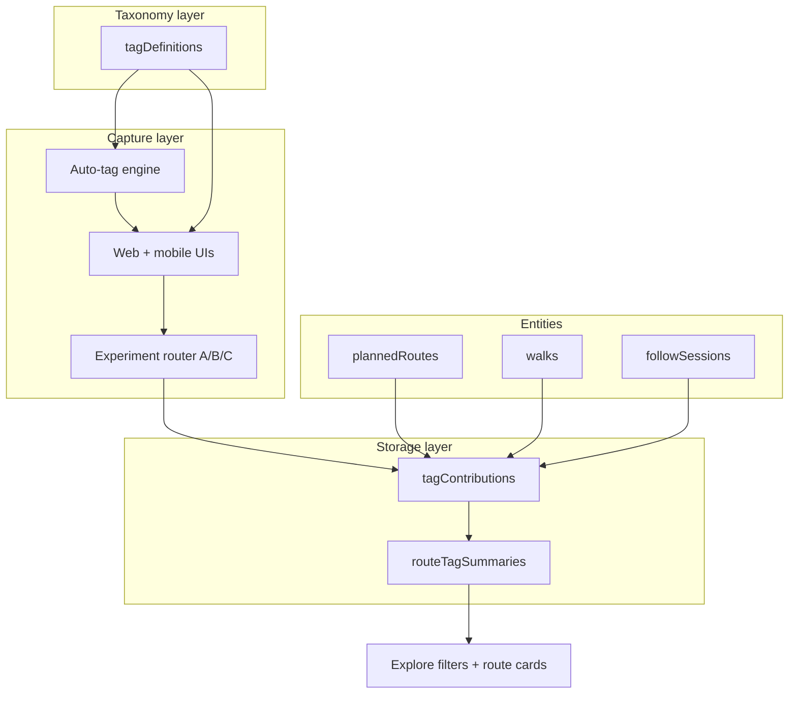

# Tagging System — Delivery Roadmap

**Requirements source:** [`taggingsystem.md`](taggingsystem.md)  
**Status:** Planning — not yet implemented  
**Last updated:** June 2025

---

## Overview

This roadmap describes how to deliver Rambleio’s **controlled-vocabulary tagging system** for:

- **Planned routes** — creator-selected objective tags at save/publish time  
- **Completed walks** — community evidence that feeds route-level confidence (not direct route mutation)  
- **Follow sessions** — same contribution flow as walks when a user followed a route  

It also covers **automatic tag suggestions**, **seasonal/time-sensitive reporting**, and an **A/B/C UI experiment** to choose the best capture interface.

### Current state (baseline)

| Area | Today |
|------|--------|
| `plannedRoutes` | Geometry, stats, visibility — **no route tags** |
| `walks` | Stats, track points — **no link to planned route**, **no tags** |
| `followSessions` | Progress tracking — **no tag capture** |
| `places.tags` | Free-form `string[]` on POIs only — **not controlled vocabulary** |
| Explore filters | Distance, elevation, duration — **no tag filters** |
| Save route UI | `SaveRouteDialog` in `planner-overlay.tsx` — title, description, visibility |
| Walk review UI | `ActivityDetail` in `activity-overlay.tsx` — stats only, no post-walk prompt |

### Design constraints (from requirements)

1. **Controlled vocabulary** — users pick from taxonomy, never free-text tags  
2. **Walk tags ≠ route tags** — walk contributions aggregate into route confidence  
3. **Objective vs subjective vs seasonal** — different display and decay rules  
4. **Minimise manual effort** — auto-suggest first, user confirms/edits  
5. **Experiment before committing** — ship A, B, and C in parallel behind assignment  

---

## Target architecture



---

## Phase 0 — Taxonomy & data model design (1 week)

**Goal:** Lock schema and seed the first tag set before any UI work.

### 0.1 Define tag taxonomy (TypeScript + seed)

Create `convex/tagTaxonomy.ts` (or JSON seed loaded by migration):

- Stable **`slug`** per tag (e.g. `landscape.coastal`, `terrain.muddy`)  
- **`category`** enum matching requirements: landscape, terrain, path_type, route_style, difficulty, facilities, features, accessibility, dog, seasonal, hazards  
- **`kind`:** `objective` | `subjective` | `seasonal`  
- **`label`**, **`description`**, **`sortOrder`**, **`isActive`**  
- **`autoDetectRule`** optional key for suggestion engine  

**MVP seed size:** ~60–80 tags across categories (not full 200+ on day one). Mark remainder `isActive: false` until curated.

### 0.2 Schema additions (Convex)

New tables (names illustrative — align with Convex guidelines on deploy):

#### `tagDefinitions`

| Field | Type | Notes |
|-------|------|--------|
| `slug` | string | Unique, indexed |
| `category` | string | Filter/group in UI |
| `kind` | objective \| subjective \| seasonal | Drives aggregation rules |
| `label` | string | Display |
| `description` | optional string | Tooltip copy |
| `sortOrder` | number | Chip order |
| `isActive` | boolean | Hide deprecated tags |
| `seasonalMonths` | optional number[] | 1–12, for seasonal tags |

Indexes: `by_slug`, `by_category_and_sortOrder`

#### `tagContributions`

One row per **user assertion** about an entity.

| Field | Type | Notes |
|-------|------|--------|
| `tagId` | id(tagDefinitions) | |
| `userId` | id(users) | |
| `entityType` | planned_route \| walk \| follow_session | |
| `entityId` | string | Polymorphic id as string |
| `plannedRouteId` | optional id(plannedRoutes) | **Denormalised** — route being described (walk on a route) |
| `source` | creator \| walker \| auto_confirmed \| auto_rejected | Provenance |
| `reportedAt` | number | Unix ms |
| `experimentVariant` | optional A \| B \| C | Analytics |
| `questionnaireAnswers` | optional any | Experiment C raw answers |

Indexes:

- `by_entityType_and_entityId`  
- `by_plannedRouteId_and_tagId` — aggregation hot path  
- `by_userId_and_entityType_and_entityId_and_tagId` — **enforce one contribution per user/tag/entity**

#### `routeTagSummaries`

Denormalised rollups for **planned routes** (read-optimised for Explore).

| Field | Type | Notes |
|-------|------|--------|
| `plannedRouteId` | id(plannedRoutes) | |
| `tagId` | id(tagDefinitions) | |
| `confirmationCount` | number | Walker confirmations |
| `creatorConfirmed` | boolean | Route author selected at create |
| `autoSuggested` | boolean | From detection engine |
| `lastReportedAt` | number | For seasonal recency |
| `confidenceScore` | number | 0–1 derived score |

Indexes: `by_plannedRouteId`, `by_plannedRouteId_and_tagId`

**Optional v1 shortcut:** skip `routeTagSummaries` and aggregate in queries; add table when Explore latency matters.

#### `users` (extend)

| Field | Type | Notes |
|-------|------|--------|
| `taggingExperimentVariant` | optional A \| B \| C | Sticky assignment |
| `taggingExperimentAssignedAt` | optional number | |

#### `plannedRoutes` (extend)

| Field | Type | Notes |
|-------|------|--------|
| `creatorTagIds` | optional id(tagDefinitions)[] | Snapshot at save (objective + creator-chosen) |
| `linkedWalkCount` | optional number | Future analytics |

#### `walks` / `followSessions` (extend)

| Field | Type | Notes |
|-------|------|--------|
| `plannedRouteId` | optional id(plannedRoutes) | **New** — link walk to route for aggregation |
| `taggingCompletedAt` | optional number | Skip re-prompting |
| `taggingSkipped` | optional boolean | User dismissed prompt |

### 0.3 Deliverables

- [ ] Schema PR with widen-only fields on existing tables  
- [ ] Seed script / admin mutation to load `tagDefinitions`  
- [ ] `convex/tags.ts` — queries: `listActiveTags`, `getRouteTagSummary`, `getTaggingExperiment`  
- [ ] Unit tests for aggregation pure functions in `lib/tag-aggregation.ts`  

---

## Phase 1 — Backend: contributions & aggregation (1–2 weeks)

**Goal:** Persist tags and compute route-level confidence without UI experiments yet.

### 1.1 Mutations

| Mutation | Purpose |
|----------|---------|
| `tags.submitCreatorTags` | Route save — replace creator tags on `plannedRoutes` + write `tagContributions` with `source: creator` |
| `tags.submitWalkTags` | Post-walk — write contributions, trigger rollup |
| `tags.submitFollowSessionTags` | Same as walk, keyed to `followSessions` |
| `tags.recomputeRouteSummaries` | Internal — called after walk tag batch (or scheduled) |

### 1.2 Aggregation rules

Implement in `lib/tag-aggregation.ts`:

| Tag kind | Route display rule |
|----------|-------------------|
| **Objective** | Show if creator tagged **or** ≥ N walker confirmations (N=3 for MVP) |
| **Subjective** | Show if ≥ N confirmations; display count (“Great Views · 67 walkers”) |
| **Seasonal** | Weight by **recency** — decay scores older than 90 days; show “Last reported 2 weeks ago” |

Walk contributions **never patch** `plannedRoutes.creatorTagIds` directly — only update `routeTagSummaries` / aggregated view.

### 1.3 Link walks to routes

Required for community confirmation on planned routes:

- Mobile + web: set `walks.plannedRouteId` when walk followed a route or user selects route on completion  
- `followSessions` already has `walkId` (source route) — map to `plannedRoutes` if source is a planned route (may need `walks.plannedRouteId` on source walk or direct `plannedRouteId` on session)

**Decision needed:** Can a recorded walk reference a `plannedRoute` directly, or only via another walk? **Recommend:** add optional `plannedRouteId` on `walks` and `followSessions`.

### 1.4 Deliverables

- [ ] All mutations + auth checks (owner for creator tags; walker for walk tags)  
- [ ] Query: `planned_routes.getWithTags` for Explore  
- [ ] Admin dashboard query: contribution counts by tag  

---

## Phase 2 — Auto-tag detection (1 week, parallel with Phase 3)

**Goal:** Suggest tags to reduce manual effort (Experiment B dependency).

Create `lib/tag-auto-detect.ts` — pure functions, testable:

| Signal | Suggested tags |
|--------|----------------|
| Route geometry closed loop | `route_style.circular` |
| Single leg, endpoints far | `route_style.point_to_point` |
| Same start/end | `route_style.out_and_back` |
| `stats.elevationGainM` / distance ratio | `terrain.flat`, `terrain.hilly`, `terrain.mountainous` |
| `computeRouteGrade` (existing) | `difficulty.*` mapping |
| Distance bands | internal metadata (filter, not always shown as chip) |
| Mapbox tile / land cover (future) | `landscape.coastal`, `landscape.woodland` — **Phase 2b** |
| POI types on route | `facilities.parking`, `facilities.toilets`, etc. |

Expose `tags.suggestForRoute({ legs, stats, pois })` query returning `{ tagId, confidence, reason }[]`.

**MVP:** geometry + stats + linked POI types only (no external land-cover API).

---

## Phase 3 — Experiment assignment mechanism (3–5 days)

**Goal:** Sticky, measurable assignment of UI variant A, B, or C.

### 3.1 Assignment strategy

```
on first tag prompt (or first dashboard visit after feature flag):
  if user.taggingExperimentVariant → return it
  else assign via weighted random or deterministic hash(userId)
  persist on users table
```

| Approach | Pros | Cons |
|----------|------|------|
| **Random sticky** | Simple, unbiased | Needs enough traffic per variant |
| **Hash(userId) % 3** | Reproducible, no race | Slight imbalance on small N |
| **Admin override** | Force internal dogfood to C | Manual |

**Recommend:** hash-based sticky assignment + Convex `taggingExperimentConfig` document (weights, enabled variants, feature flag).

### 3.2 API

```ts
// Query
getTaggingExperiment() → {
  variant: 'A' | 'B' | 'C',
  enabled: boolean,
  config: { showSkip: boolean, maxQuestions: number }
}

// Mutation (internal)
assignTaggingExperiment() → variant
```

### 3.3 Analytics events (store on contributions)

Every submission records `experimentVariant`. Track:

- Prompt shown / completed / skipped  
- Time to complete  
- Tags per submission  
- Variant × completion rate  

**MVP analytics:** log to `tagContributions.experimentVariant` + optional `taggingEvents` table if funnels need finer grain.

### 3.4 Feature flag

- Env / Convex config: `TAGGING_EXPERIMENTS_ENABLED`  
- When false: no prompts; creator tags still work in planner (Phase 4)  

### 3.5 Deliverables

- [ ] `getTaggingExperiment` + assignment mutation  
- [ ] Admin-only mutation to set user variant (testing)  
- [ ] Docs for interpreting experiment results  

---

## Phase 4 — UI: route creation & edit (web) (1 week)

**Goal:** Creators tag routes when saving in the planner.

### 4.1 Entry points

| Location | Change |
|----------|--------|
| `SaveRouteDialog` (`planner-overlay.tsx`) | Add tag step or expandable “Route characteristics” section |
| Route edit flow | Load existing `creatorTagIds` |
| `SelectedRoutePanel` (`explore-overlay.tsx`) | **Display** aggregated tags + confidence (read-only for non-owners) |

### 4.1 Experiment routing for **creators**

Creators always need full vocabulary for objective tags. **Recommendation:**

- **Route create/edit:** always use **Experiment A (category browser)** regardless of user variant — creators are power users  
- **Walk completion:** use assigned A/B/C variant  

Document this split in experiment analysis so creator UI is not confounded with walk capture experiments.

### 4.2 UI components (shared)

| Component | Path | Role |
|-----------|------|------|
| `TagCategoryBrowser` | `src/components/tags/tag-category-browser.tsx` | Experiment A — chips by category |
| `TagSmartConfirmation` | `src/components/tags/tag-smart-confirmation.tsx` | Experiment B — confirm suggestions + quick adds |
| `TagQuestionnaire` | `src/components/tags/tag-questionnaire.tsx` | Experiment C — mapped questions |
| `TagChip` / `TagChipList` | `src/components/tags/` | Display on route cards |
| `TagExperimentRouter` | `src/components/tags/tag-experiment-router.tsx` | Calls `getTaggingExperiment`, renders A/B/C |

### 4.3 Save flow

1. User completes planner → Save dialog  
2. Auto-suggest tags (Phase 2) pre-selected in browser  
3. User adjusts → `tags.submitCreatorTags` on save with route id  
4. Explore panel shows creator tags immediately; walker confirmations accumulate later  

### 4.4 Deliverables

- [ ] SaveRouteDialog updated  
- [ ] Explore route detail shows tag chips + counts  
- [ ] Edit route reloads tags  

---

## Phase 5 — UI: walk & follow-session completion (web + mobile) (2 weeks)

**Goal:** Capture walker evidence after activity.

### 5.1 Web — Activity overlay

| Trigger | UI |
|---------|-----|
| User opens completed walk in `ActivityDetail` | If `!taggingCompletedAt && !taggingSkipped` → show `TagExperimentRouter` modal/sheet |
| Follow session completes | Same flow via `followSessions` |

Flow:

1. `getTaggingExperiment`  
2. Load `tags.suggestForWalk` (track + route context)  
3. Render A, B, or C  
4. Submit → `tags.submitWalkTags`  
5. Set `taggingCompletedAt`  

### 5.2 Mobile (Expo app — monorepo root)

Walk completion is primarily mobile. **Required for full system:**

- Same Convex mutations  
- Same `TagExperimentRouter` (React Native port or WebView sheet)  
- Set `walks.plannedRouteId` on sync when applicable  

**Web-only MVP acceptable** for experiment pilot if mobile lags — document bias in results.

### 5.3 Deliverables

- [x] Post-walk tagging sheet on web (`WalkTaggingPrompt` in `ActivityDetail`)  
- [x] Post-walk tagging sheet on mobile (`WalkTaggingSheet` in `walk-summary.tsx`)  
- [x] Skip (sets `taggingSkipped` via `submitWalkTags` with `skipped: true`)  
- [ ] Re-prompt after 7 days on skip (optional — deferred)  
- [x] Mobile parity: `plannedRouteId` on local walk + Convex sync, experiment A/B/C, `ensureWalkOnConvex` before prompt  

---

## Phase 6 — Discovery & filters (1 week)

**Goal:** Tags improve Explore, not just storage.

### 6.1 Explore overlay

- Extend `FilterBar` with tag category filters (multi-select chips)  
- Filter `planned_routes.listWithinBoundsWithAuthors` by tag slugs (requires index or summary join)  
- Route cards: show top 3 tags + “+N more”  

### 6.2 Search (future)

- Full-text on title + tag labels — defer post-MVP  

### 6.3 Deliverables

- [x] Tag filter UI (web FilterBar + mobile header filter modal)  
- [x] Backend filter query (`tags.getExploreTagEnrichment`)  
- [x] Empty state when no routes match tags  

---

## Phase 7 — Experiment evaluation & winner selection (ongoing)

**Goal:** Pick default UX after ~4–6 weeks of beta data.

### Metrics (from requirements comparison table)

| Metric | How measured |
|--------|----------------|
| Completion rate | submissions / prompts shown |
| Tags per submission | avg tags on `tagContributions` |
| Time on task | modal open → submit |
| Data richness | unique tag slugs per 100 walks |
| Seasonal coverage | seasonal tag reports per month |
| User sentiment | optional thumbs-up on B/C |

### Decision process

1. Review dashboards grouped by `experimentVariant`  
2. Qualitative session recordings (5 users per variant)  
3. **Default:** likely B for walks, A for route create — unless data strongly favours C for casual walkers  
4. Remove losing UIs from codebase or hide behind admin flag  

---

## Phase 8 — Hardening & migration (1 week)

- [ ] Migrate `places.tags` free strings → link to `tagDefinitions` where possible (or leave POI-specific)  
- [ ] Rate limits on tag submissions  
- [ ] Moderation: flag spam contributions  
- [ ] i18n: tag labels English-only MVP  
- [ ] Update [`docs/sitemap.md`](sitemap.md), [`AGENTS.md`](../AGENTS.md), `global-pace`-style skill → `tagging` skill  

---

## Suggested delivery timeline

| Phase | Duration | Depends on |
|-------|----------|------------|
| 0 Taxonomy & schema | 1 week | — |
| 1 Backend | 1–2 weeks | 0 |
| 2 Auto-detect | 1 week | 0 |
| 3 Experiment assignment | 3–5 days | 0 |
| 4 Route UI (web) | 1 week | 1, 2 |
| 5 Walk UI (web + mobile) | 2 weeks | 1, 2, 3 |
| 6 Explore filters | 1 week | 1, 4 |
| 7 Evaluation | 4–6 weeks parallel | 5 live |
| 8 Hardening | 1 week | 7 |

**Total engineering:** ~8–10 weeks to full beta; **MVP (creator tags + walk experiment B only):** ~4 weeks.

---

## MVP cut (recommended first ship)

Ship the smallest vertical slice that validates the model:

1. `tagDefinitions` seeded (~40 tags)  
2. Creator tagging in SaveRouteDialog (**Experiment A only**)  
3. Walk tagging (**Experiment B only**) on web Activity detail  
4. Sticky experiment assignment (B for walks; reserve A/B/C switch for phase 3)  
5. Basic aggregation on route detail (“Confirmed by N walkers”)  
6. **Defer:** Explore tag filters, Experiment C, mobile, seasonal decay polish  

---

## Open decisions

| # | Question | Recommendation |
|---|----------|----------------|
| 1 | Link `walks` → `plannedRoutes` directly? | **Yes** — add `plannedRouteId` on walks and followSessions |
| 2 | Creator experiment variant | **Always A** for route save; A/B/C only for walk completion |
| 3 | Re-prompt if user skips tagging? | Once; then respect `taggingSkipped` for 30 days |
| 4 | Minimum confirmations to show subjective tag | **3** for beta, tune later |
| 5 | Aggregate table vs query-time | Start query-time; add `routeTagSummaries` if slow |
| 6 | Tag editing after walk submit | Allow within 24h via same contribution row patch |

---

## File map (planned)

```
convex/
  schema.ts                 — extend users, walks, plannedRoutes, followSessions
  tagDefinitions.ts         — seed + admin CRUD
  tags.ts                   — queries, mutations, experiment assignment
  tagAggregation.ts         — rollup helpers (or lib/ mirrored in convex/)

src/lib/
  tag-auto-detect.ts        — suggestion engine
  tag-aggregation.ts        — pure rollup + seasonal decay
  tag-questionnaire-map.ts  — Experiment C answer → tagIds

src/components/tags/
  tag-category-browser.tsx    — Experiment A
  tag-smart-confirmation.tsx  — Experiment B
  tag-questionnaire.tsx       — Experiment C
  tag-experiment-router.tsx
  tag-chip-list.tsx

src/components/map/
  planner-overlay.tsx       — SaveRouteDialog + tags
  explore-overlay.tsx       — display + filters
  activity-overlay.tsx      — post-walk prompt
```

---

## Success criteria

- [ ] Route creators can assign objective tags at save; tags appear on Explore route detail  
- [ ] Walkers see assigned experiment UI after completing a walk linked (or linkable) to a route  
- [ ] Walker tags aggregate to route-level confirmation counts without overwriting creator tags  
- [ ] Seasonal tags store `reportedAt` and surface recency on route detail  
- [ ] Experiment variant is sticky per user and logged on every submission  
- [ ] Auto-suggest covers route style + difficulty + terrain for ≥70% of test routes  

---

## Related docs

- [`taggingsystem.md`](taggingsystem.md) — product requirements  
- [`sitemap.md`](sitemap.md) — routes and UI entry points  
- [`.claude/skills/convex-migration-helper/SKILL.md`](../.claude/skills/convex-migration-helper/SKILL.md) — schema widen/migrate/narrow  

---

> **Next step:** Review open decisions, approve MVP cut, then implement Phase 0 schema PR.
