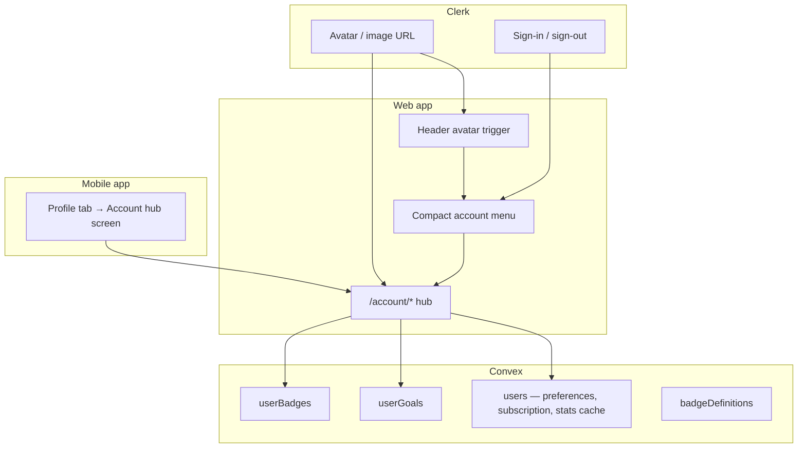

# User Menu / Account Hub — Delivery Roadmap

**Requirements source:** [`usermenu.md`](usermenu.md)  
**Visual reference:** Account hub mockup (sidebar + overview dashboard — profile header, progress stats, recent goals, recent badges)  
**Status:** Phase 6 complete (goals)  
**Last updated:** June 2026

---

## Overview

Replace the default **Clerk `UserButton` dropdown** with a Rambleio **account hub** that feels like a walking dashboard, not a generic auth menu.

| Layer | Owner | Responsibility |
|-------|--------|----------------|
| **Clerk** | Auth provider | Sign-in, sign-out, sessions, **profile image** (synced to all devices) |
| **Convex** | Product data | Preferences, subscription display, goals, badges, aggregated stats |
| **Rambleio UI** | Web + mobile | Navigation, layout, progress visualisation, goal creation |

### Design intent (from mockup)

- **Entry:** Avatar in the map header opens a **dropdown panel** (portaled; map stays mounted).
- **In-menu sections:** Overview (default), Profile, Subscription, Preferences, Goals, Badges, Sharing — tabbed inside the dropdown.
- **Overview (default):** Profile strip, **Your progress**, **Recent goals**, **Recent badges** (compact).
- **Full-page (new tab only):** Account (`/account/settings`), Help & support (`/account/help`).

---

## Current state (baseline)

| Area | Web today | Mobile today |
|------|-----------|--------------|
| User menu | Clerk `<UserButton />` in `dashboard-header.tsx`, `nav-auth-buttons.tsx` | Profile bottom sheet (`explore-sheet` pattern in `app/(tabs)/index.tsx` + `profile.tsx` tab) |
| Profile editing | `/profile` — name, weight via `users.updateProfile` | Name/email from Clerk; weight + units in local `useUserPreferences` (SQLite) |
| Avatar | Clerk image via `UserButton` only; no in-app change UI | Initial letter placeholder; no Clerk image surfaced |
| User record | `users`: `tokenIdentifier`, `name`, `email`, `weightKg`, map flags, login metadata | Same Convex user via `upsertCurrentUser` |
| Stats | Scattered: Activity tab, `/walks`, explore walk history | Sessions tab, walk summary |
| Goals / badges / subscription | **Not implemented** | **Not implemented** |
| Routes | `/profile` (settings card on map overlay) | Profile sheet |

### Gaps vs target

1. No `/account` area or sidebar navigation.
2. No aggregated **lifetime stats** query for the overview dashboard.
3. Preferences split: web uses Convex `weightKg`; mobile uses local prefs — needs **single Convex `preferences` object**.
4. Avatar change not exposed in product UI (Clerk supports `user.setProfileImage()`).
5. Goals, badges, subscription are spec-only.

---

## Target architecture



### Avatar strategy

**Clerk is the source of truth for the profile image** — correct for cross-device sync.

| Approach | Recommendation |
|----------|----------------|
| Display | `useUser().user.imageUrl` (web: `@clerk/nextjs`; mobile: `@clerk/expo`) |
| Upload | `user.setProfileImage({ file })` on web; `ImagePicker` + same API on mobile |
| Fallback | Initials circle when no image (match mockup styling) |
| Convex `avatarStorageId` | **Defer** unless we need avatars independent of Clerk (e.g. offline-only). Spec in `usermenu.md` is optional. |

Do **not** duplicate avatar storage in Convex for MVP — reduces sync bugs.

### URL structure (web)

| Route | Purpose |
|-------|---------|
| `/account` | Redirect → `/account/overview` |
| `/account/overview` | Dashboard (mockup main panel) |
| `/account/profile` | Display name, email (read-only from Clerk), avatar upload |
| `/account/subscription` | Beta plan card; billing placeholders |
| `/account/preferences` | Units, weight, display defaults |
| `/account/goals` | Goal list + create |
| `/account/badges` | Badge gallery |
| `/account/sharing` | Placeholder / “Coming soon” |
| `/account/help` | Links, support, version |
| `/profile` | **Redirect** to `/account/profile` (keep old links working) |

Hub uses `(dashboard)` layout group: sidebar + content, **without** the full-screen map (unlike `/map`). Header can show a slim Rambleio bar + back to map.

---

## Data model (phased)

### Phase A — Extend `users` (no new tables) ✅ Schema deployed

Implemented in `convex/schema.ts`, `convex/userValidators.ts`, `convex/userAccountCore.ts`, `convex/users.ts`.

```typescript
preferences?: {
  units?: { distance: "km" | "miles"; weight: "kg" | "lb" };
  profile?: { weightKg?: number };
  display?: { defaultMapView?: "terrain" | "standard"; showCalories?: boolean };
  privacy?: { defaultWalkVisibility?: "private" | "public" };
};
subscription?: {
  plan: "beta";  // later: "free" | "plus" | "pro"
  status: "active";
};
// Optional denormalised cache for fast overview — recompute from walks periodically
statsCache?: {
  walkCount: number;
  totalDistanceMetres: number;
  totalElevationGainMetres: number;
  totalMovingTimeSeconds: number;
  updatedAt: number;
};
```

**Migration:** Move existing `weightKg` → `preferences.profile.weightKg` with widen-migrate-narrow; keep reading old field until backfill completes.

### Phase B — New tables (goals & badges) ✅ Schema deployed

Tables: `userGoals`, `badgeDefinitions`, `userBadges`. Seed: `convex/badgeDefinitionsSeed.ts` + `account.adminSeedBadgeDefinitions`.

| Table | Purpose |
|-------|---------|
| `userGoals` | Active/completed goals, type, target, window, progress snapshot |
| `badgeDefinitions` | Data-driven badge catalogue (category, slug, criteria metadata) |
| `userBadges` | `userId`, `badgeId`, `unlockedAt`, optional `metadata` |
| `userProgressEvents` | Optional audit log for unlock analytics (defer if heavy) |

Badge catalogue: seed from `usermenu.md` lists (10×10 categories); unlock via Convex mutations/crons evaluating walks, routes, profile state.

### One-time admin setup (after deploy)

Run as admin in the Convex dashboard:

1. `account.adminBackfillUsers` — default subscription, migrate `weightKg` → `preferences`, set timestamps on existing users.
2. `account.adminSeedBadgeDefinitions` — insert starter badge catalogue (10 badges).

New sign-ins via `users.upsertCurrentUser` get defaults automatically.

---

## Web delivery phases

### Phase 1 — Account shell & avatar entry (1 week)

**Goal:** Replace `UserButton` with Rambleio UI; hub skeleton matches mockup layout.

| Deliverable | Detail |
|-------------|--------|
| `AccountMenuTrigger` | Header avatar + chevron; opens dropdown panel (portal) |
| Dropdown panel | Tabbed sections: Overview, Profile, Preferences, Goals, Badges, etc. |
| Overview in menu | Compact progress, goals, badges (mock data OK) |
| Full-page new tab | Account + Help only (`target="_blank"`) |
| Remove `UserButton` | `dashboard-header.tsx`, `nav-auth-buttons.tsx` |
| Map preserved | No navigation away from map for in-menu sections |

**Exit criteria:** Signed-in user sees branded dropdown with overview; map not reloaded; Account/Help open in new tab; sign-out works.

---

### Phase 2 — Profile & avatar upload (3–5 days) ✅

**Goal:** User can view and change avatar; profile fields editable.

| Deliverable | Detail |
|-------------|--------|
| Avatar display | Clerk `imageUrl` with initials fallback |
| Rambleio presets | 6 placeholder icons in `/public/avatars/` → rasterised PNG → Clerk |
| Avatar upload | File input → `user.setProfileImage({ file })`; loading/error states |
| Display name | Clerk `user.update` + Convex `users.updateProfile` |
| Email | Read-only from Clerk (managed in Clerk account if needed later) |
| Beta badge | Hidden when `subscription.plan !== "beta"` |
| Profile in dropdown | `AccountMenuProfile` in account menu panel |

**Exit criteria:** Avatar change visible on web after refresh; same avatar on another device after Clerk sync.

---

### Phase 3 — Preferences & Convex unification (1 week) ✅

**Goal:** Single preferences source for web; path to mobile convergence.

| Deliverable | Detail |
|-------------|--------|
| Schema | `users.preferences` object (see above) |
| `users.getPreferences` / `users.updatePreferences` | Validated partial updates |
| Account menu Preferences tab | Units (km/miles, kg/lb), weight, display toggles, privacy default |
| Migrate `/profile` | Redirects to `/map`; weight moved to Preferences |
| Web consumers | Activity, Explore, Planner, walks list use `useUserPreferences()` |
| `UserPreferencesProvider` | Dashboard layout; `format-units.ts` helpers |

**Exit criteria:** Preferences persist in Convex; web map/activity respect units.

---

### Phase 4 — Overview stats (live data) (3–5 days) ✅

**Goal:** “Your progress” rings show real numbers from completed walks.

| Deliverable | Detail |
|-------------|--------|
| `users.getLifetimeStats` query | Aggregate `walks` where `status === "completed"` for current user |
| Overview cards | Walk count, total km, total ascent, total moving time |
| “View all stats” | Link to `/map?mode=activity` or future `/account/stats` |
| Optional `statsCache` | Nightly or on-walk-complete mutation to avoid large aggregates |

**Exit criteria:** Overview stats match Activity tab totals.

**Implemented:** `users.getLifetimeStats` + `aggregateLifetimeStats` in `userAccountCore.ts`; `AccountMenuOverview` uses Convex live query with unit-aware formatting; “View all stats” links to Activity tab.

---

### Phase 5 — Subscription UI (2–3 days) ✅

**Goal:** Beta plan presentation; ready for Stripe later.

| Deliverable | Detail |
|-------------|--------|
| `/account/subscription` | Plan name, status, benefits list, “Beta participant” copy |
| Placeholder actions | Disabled “Upgrade” / “Manage billing” with tooltip |
| Compact menu link | Subscription row with badge |

**Exit criteria:** No billing integration required; UI slot exists for provider IDs later.

**Implemented:** `SubscriptionPanel` in account dropdown + `/account/subscription` deep link; `src/lib/subscription.ts` for plan copy and Stripe-ready action gating; sidebar Beta badge on Subscription nav.

---

### Phase 6 — Goals (1–2 weeks) ✅

**Goal:** Users create goals; overview shows recent progress bars.

| Deliverable | Detail |
|-------------|--------|
| `userGoals` table + CRUD | Types: distance, walk_count, duration, streak, elevation, route_creation |
| Progress engine | Convex query recomputes from `walks` (+ `plannedRoutes` for route goals) |
| `/account/goals` | List, create wizard, archive completed |
| Overview “Recent goals” | Top 3 active goals with progress bars (mockup style) |
| Templates | “Walk 100 km this month”, “3 walks this week”, etc. |

**Exit criteria:** Creating a goal updates progress after new walks sync.

**Implemented:** Data-driven `goalCatalog.ts` (8 categories incl. virtual journeys & famous climbs); `userGoals` CRUD + live progress; 3 active goal cap; dropdown create wizard (category → period → target/challenge); overview recent goals; `/account/goals` page.

---

### Phase 7 — Badges (2–3 weeks)

**Goal:** Automatic unlocks; gallery; overview recent badges; admin-managed catalogue.

**Detailed plan:** [`badgeSystemRoadmap.md`](badgeSystemRoadmap.md) — data model, rule engine, admin console (`/admin/badges`, `isAdmin` only), ~100-badge seed strategy, mockup-aligned hex UI.

| Deliverable | Detail |
|-------------|--------|
| `badgeCategories` + `badgeDefinitions` v2 | Data-driven rules (`ruleType` + `ruleConfig`), tiers, seasons |
| Badge engine | `evaluateBadgesForUser` on walk complete + profile/goal hooks |
| `userBadges` + `userBadgeProgress` | Unlocks + in-progress bars |
| `/account/badges` + account menu | Hex gallery by category (mockup) |
| Overview “Recent badges” | Last 5 unlocked hex icons |
| `/admin/badges` | CRUD categories & badges; rule preview; unlock stats |

**Exit criteria:** First walk unlocks “First Steps”; avatar upload unlocks “Profile Ready”; admin can add a badge without code deploy.

**Phased delivery:** 7a engine → 7b gallery → 7c admin → 7d progress/hooks → 7e full catalogue (see badge roadmap).

---

### Phase 8 — Sharing & help (later)

| Deliverable | Detail |
|-------------|--------|
| `/account/sharing` | “Coming soon” + newsletter / invite copy |
| `/account/help` | FAQ links, contact, app version |
| Community-light badges | When sharing features ship |

---

## Mobile delivery phases (after web Phase 4 minimum)

Mobile should **reuse Convex APIs**; UI adapts mockup to native patterns.

### Mobile Phase M1 — Account hub screen (1 week)

**Depends on:** Web Phase 1–3 (layout patterns + preferences API)

| Deliverable | Detail |
|-------------|--------|
| Replace profile sheet | Full-screen **Account** stack or tab (`app/account/` or refactor `profile.tsx`) |
| Sidebar → section list | iOS-style grouped list navigation to sub-screens |
| Overview screen | Same sections as web overview (stats, goals preview, badges preview) |
| Header avatar | Clerk `user.imageUrl` instead of letter-only |
| Sign out | Clerk `signOut` (existing) |

---

### Mobile Phase M2 — Avatar & preferences sync (3–5 days)

**Depends on:** Web Phase 2–3

| Deliverable | Detail |
|-------------|--------|
| Avatar upload | `expo-image-picker` → `user.setProfileImage` |
| Preferences | Read/write Convex `users.preferences`; migrate off local-only units where duplicated |
| Conflict policy | Convex wins for weight/units; local SQLite for device-only settings (haptics, etc.) |

---

### Mobile Phase M3 — Goals & badges (1–2 weeks)

**Depends on:** Web Phase 6–7

| Deliverable | Detail |
|-------------|--------|
| Goals screens | Native list + create flow |
| Badges gallery | Hex grid, category filters |
| Push/local notification | Optional: “Badge unlocked” toast on walk complete |

---

### Mobile Phase M4 — Polish & parity (ongoing)

- Subscription screen
- Help & support
- Deep links: `rambleio://account/goals`
- Tablet: two-column layout closer to web mockup

---

## Suggested timeline

| Phase | Web | Mobile |
|-------|-----|--------|
| 1 Account shell | Week 1 | — |
| 2 Profile & avatar | Week 2 | — |
| 3 Preferences | Week 3 | — |
| 4 Live stats | Week 3–4 | — |
| 5 Subscription UI | Week 4 | — |
| 6 Goals | Weeks 5–6 | M1 Hub (week 7) |
| 7 Badges | Weeks 7–9 | M2 Avatar/prefs (week 8) |
| 8 Sharing | Backlog | M3 Goals/badges (weeks 9–10) |

**Web MVP (ship first):** Phases **1–4** — branded menu, hub overview with real stats, avatar upload, preferences. Goals/badges can show “Coming soon” cards on overview until Phases 6–7 land.

---

## MVP cut (recommended first ship)

1. Custom avatar trigger + compact menu (no Clerk chrome)
2. `/account/overview` + `/account/profile` + `/account/preferences`
3. Clerk avatar upload
4. Live lifetime stats on overview
5. Beta subscription card
6. `/profile` redirect
7. Mobile: defer until web preferences API is stable

---

## Key files (web — planned)

| Path | Role |
|------|------|
| `src/components/account/account-menu-trigger.tsx` | Header avatar + toggle |
| `src/components/account/account-menu-panel.tsx` | Portaled dropdown with tabbed sections |
| `src/components/account/account-menu-overview.tsx` | Compact overview inside dropdown |
| `src/app/(account)/account/settings/page.tsx` | Full-page Account (new tab) |
| `src/app/(account)/account/help/page.tsx` | Full-page Help (new tab) |
| `convex/users.ts` | Preferences, stats, subscription helpers |
| `convex/userGoals.ts` | Phase 6 |
| `convex/badges.ts` | Phase 7 (may extend existing tag badge patterns) |

## Key files (mobile — planned)

| Path | Role |
|------|------|
| `app/account/_layout.tsx` | Stack navigator |
| `app/account/index.tsx` | Overview |
| `components/account/` | Shared section components |

---

## Risks & decisions

| Topic | Recommendation |
|-------|----------------|
| Clerk vs Convex avatar | **Clerk only** for MVP |
| `/profile` vs `/account` | Redirect old URL; update `sitemap.md`, `robots.ts` |
| Stats aggregation cost | Start with live query; add `statsCache` if `walks` table grows |
| Badge scope | Ship 20–30 badges first, not all 100 |
| Mobile prefs | Keep device-only settings local; sync product prefs via Convex |
| UserProfile component | Avoid embedding full Clerk `<UserProfile />` — custom UI matches mockup |

---

## Documentation updates (as phases ship)

- [`usermenu.md`](usermenu.md) — mark sections implemented
- [`sitemap.md`](sitemap.md) — add `/account/*`, note `/profile` redirect
- [`AGENTS.md`](../AGENTS.md) — account hub conventions
- Beta **What’s new** on `/home` per phase

---

## Reference

- Requirements: [`usermenu.md`](usermenu.md)
- Mockup: Account hub with sidebar (Overview active), profile header with mountain illustration, progress stats row, three goal progress bars, five hex badges
- Clerk avatar API: [`user.setProfileImage`](https://clerk.com/docs/references/javascript/user/user#set-profile-image) (web + Expo Clerk SDK)
