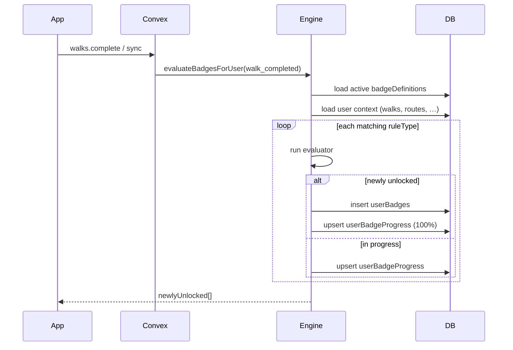

# Badge System — Delivery Roadmap

**Parent:** [UserMenuRoadmap.md](UserMenuRoadmap.md) Phase 7  
**Requirements:** [usermenu.md](usermenu.md) (10×10 badge catalogue), user badge design spec (March 2026)  
**Visual reference:** Rambleio Badges mockup — hex tiles, category colours, Bronze → Platinum tiers  
**Status:** Planned — schema partially deployed; engine, gallery, and admin console not built  
**Last updated:** June 2026

---

## 1. Goals

| Goal | Detail |
|------|--------|
| **Data-driven content** | Badge names, rules, tiers, and categories live in Convex — not in app code |
| **Controlled evaluation** | A fixed set of **rule types** in code; admins configure via `ruleConfig` JSON |
| **Automatic unlocks** | Evaluate after walks sync, routes planned, goals created, profile updates, etc. |
| **User gallery** | Account menu + `/account/badges` — locked / in-progress / earned, filter by category |
| **Admin console** | `/admin/badges` — CRUD categories & badges, preview rules, unlock stats; **`users.isAdmin` only** |
| **Scale to ~100 badges** | Full catalogue from `usermenu.md` + mockup without per-badge code changes |

### Core principle

```text
Data controls badge content.
Code controls what kinds of checks are safe and supported.
```

Adding “Walk 500 km total” or “Climb Snowdon” should be **admin data entry**, not a deploy — as long as `total_distance` / `total_elevation_gain` rule types exist.

---

## 2. Current baseline

### Already in Convex

| Piece | State |
|-------|--------|
| `badgeDefinitions` table | Deployed — **legacy shape** (see §4 migration) |
| `userBadges` table | Deployed — `userId`, `badgeId`, `unlockedAt`, optional `metadata` |
| `badgeDefinitionsSeed.ts` | 10 starter badges (Getting Started + Distance) |
| `account.adminSeedBadgeDefinitions` | Admin mutation — upsert from seed file |
| `authHelpers.requireAdmin` | Checks `users.isAdmin === true` |
| `badgeCategoryValidator` | 10 category slugs (hardcoded union) |
| `badgeCriteriaTypeValidator` | 12 criteria types (hardcoded union) |

### Not built yet

- Badge evaluation engine
- `userBadgeProgress` table
- `badgeCategories` table (categories embedded in enum today)
- User-facing gallery (account menu still uses `MOCK_BADGES`)
- Admin UI (`/admin/badges`)
- Event hooks on walk complete / route plan / etc.
- Progress bars toward next badge

### Related product data (unlock inputs)

Completed walks already store: `distanceMetres`, `durationSeconds`, `movingTimeSeconds`, `elevationGainMetres`, `avgPaceSecsPerKm`, `pointCount` ([`walks.stats`](../../convex/schema.ts)).  
Walk photos are timestamped events (`walkPhotos`).  
Goals, routes, follow sessions, and tagging exist or are planned — rule types should align with these tables.

---

## 3. Visual design (mockup)

### Layout

- **Header:** Rambleio wordmark + colour legend for categories  
- **Grid:** 10 category blocks × 10 hex badges each (100 total target)  
- **Footer:** Tier legend + “earned automatically” copy  

### Badge tile

| Element | Spec |
|---------|------|
| Shape | Hexagon (`clip-path` or SVG) |
| Icon | White line-art on category-tinted fill |
| Tier border | Bronze (solid) → Silver → Gold → Platinum (glow) |
| Label | Short name under tile; number 1–10 within category |
| Locked | Desaturated / padlock overlay; `lockedDescription` on hover |
| Earned | Full colour + `unlockedAt` in detail panel |
| In progress | Optional ring or % when `userBadgeProgress` exists |

### Category colours (align with Rambleio palette)

| Category key | Display name | Colour | Hex (mockup) |
|--------------|--------------|--------|----------------|
| `getting_started` | Getting Started | Green | `#2E7D32` |
| `distance_milestones` | Distance | Orange | `#E65100` |
| `consistency` | Consistency | Teal | `#00897B` |
| `monthly_challenges` | Monthly Challenges | Purple | `#7B1FA2` |
| `exploration` | Exploration | Blue | `#1565C0` |
| `route_planning` | Route Planning | Olive | `#827717` |
| `recording_quality` | Recording Quality | Amber | `#FF8F00` |
| `elevation` | Elevation | Brown | `#6D4C41` |
| `following_routes` | Following Routes | Rose | `#C2185B` |
| `community_sharing` | Community / Sharing | Indigo | `#3949AB` |

Tier fills: Bronze `#CD7F32`, Silver `#C0C0C0`, Gold `#FFD700`, Platinum `#E3F2FD` + bright border.

---

## 4. Target data model

### Migration strategy: widen → migrate → narrow

The deployed `badgeDefinitions` / `userBadges` shapes are **v1**. Target is **v2** below. Ship in one Convex deploy with backfill mutation; keep reading v1 fields until backfill completes (same pattern as `preferences` / `weightKg`).

#### `badgeCategories` (new table)

Replaces the hardcoded `badgeCategoryValidator` union for **admin-managed** categories.

```ts
badgeCategories: {
  key: string,              // "distance_milestones" — stable id
  name: string,             // "Distance"
  description?: string,
  color: string,            // "#E65100"
  icon: string,             // "boot" — maps to icon set
  displayOrder: number,
  isActive: boolean,
  createdAt: number,
  updatedAt: number,
}
.index("by_key", ["key"])
.index("by_displayOrder", ["displayOrder"])
```

**Seed:** 10 rows from mockup / `usermenu.md` on first admin “Seed categories” or deploy hook.

#### `badgeDefinitions` (v2 — extend existing table)

| Field | v1 today | v2 target |
|-------|----------|-----------|
| `slug` | ✓ | Rename conceptually to **`key`** (keep `slug` as alias during migration) |
| `category` | enum literal | **`categoryKey`** → `badgeCategories.key` |
| `label` | ✓ | → **`name`** |
| `description` | ✓ | ✓ |
| `lockedDescription` | — | optional string |
| `iconKey` | optional | → **`icon`** |
| `color` | — | optional override |
| `tier` | — | `bronze` \| `silver` \| `gold` \| `platinum` |
| `criteriaType` + `criteriaThreshold` | ✓ | → **`ruleType`** + **`ruleConfig`** (JSON) |
| `points` | — | optional gamification score |
| `sortOrder` | ✓ | → **`displayOrder`** |
| `isActive` | ✓ | ✓ |
| `isHiddenUntilUnlocked` | — | boolean |
| `isRepeatable` | — | boolean (default false) |
| `startsAt` / `endsAt` | — | optional seasonal window |
| `createdAt` / `updatedAt` | — | timestamps |

```ts
// Example v2 document
{
  key: "distance_100km_total",
  categoryKey: "distance_milestones",
  name: "100 km Total",
  description: "Walk 100 km in total across all your walks.",
  lockedDescription: "Keep walking — your total distance is climbing.",
  icon: "boot",
  tier: "silver",
  ruleType: "total_distance",
  ruleConfig: { targetMetres: 100000, period: "lifetime" },
  points: 50,
  displayOrder: 6,
  isActive: true,
  isHiddenUntilUnlocked: false,
  isRepeatable: false,
}
```

**Indexes:** `by_key`, `by_categoryKey_and_displayOrder`, `by_ruleType`, `by_isActive`.

#### `userBadges` (extend)

Keep `badgeId` FK for integrity; add denormalised fields for queries and leaderboards:

```ts
userBadges: {
  userId: Id<"users">,
  badgeId: Id<"badgeDefinitions">,
  badgeKey: string,           // denormalised from definition.key

  unlockedAt: number,
  progressAtUnlock?: number,  // e.g. metres at unlock

  sourceType?: "walk" | "follow_session" | "route" | "goal" | "manual" | "system",
  sourceId?: string,

  seenAt?: number,            // UI “new” badge dot until dismissed
}
```

#### `userBadgeProgress` (new, optional but recommended)

Powers in-progress bars without re-scanning all walks on every gallery load.

```ts
userBadgeProgress: {
  userId: Id<"users">,
  badgeKey: string,
  currentValue: number,
  targetValue: number,
  progressPercent: number,
  lastEvaluatedAt: number,
}
.index("by_userId_and_badgeKey", ["userId", "badgeKey"])
```

---

## 5. Rule types (code-owned)

Rule evaluators live in **`convex/badgeEngine/`** (server) with thin shared types in **`src/lib/badges/`** (web admin previews).

### v1 — ship first (covers ~60% of catalogue)

| `ruleType` | Evaluates | `ruleConfig` shape | Maps from v1 `criteriaType` |
|------------|-----------|-------------------|----------------------------|
| `walk_count` | Count completed walks | `{ target, period? }` | `walk_count` |
| `total_distance` | Sum `stats.distanceMetres` | `{ targetMetres, period? }` | `total_distance_m` |
| `single_walk_distance` | Max single walk | `{ targetMetres }` | `single_walk_distance_m` |
| `total_elevation_gain` | Sum elevation gain | `{ targetMetres, period? }` | `total_elevation_gain_m` |
| `planned_route_count` | Count `plannedRoutes` | `{ target, period? }` | `planned_route_count` |
| `goal_created` | Any `userGoals` row | `{}` | `goal_created` |
| `has_avatar` | Clerk image / profile flag | `{}` | `has_avatar` |
| `preferences_set` | `users.preferences` populated | `{}` | `preferences_set` |
| `joined_beta` | `subscription.plan === "beta"` | `{}` | `joined_beta` |
| `walk_on_weekend` | Walk on Sat/Sun | `{ target }` | `walk_on_weekend` |
| `badge_unlocked` | Has any `userBadges` | `{}` | `badge_unlocked` |
| `manual` | Admin grant only | `{}` | `manual` |

`period`: `lifetime` \| `daily` \| `weekly` \| `monthly` \| `yearly` (reuse goal window helpers from `userGoalsCore.ts` where possible).

### v2 — second wave (remaining catalogue)

| `ruleType` | Notes | Depends on |
|------------|-------|------------|
| `monthly_distance` | Calendar month aggregate | walks |
| `weekly_walk_count` | Walks in ISO week | walks |
| `total_duration` | Sum `movingTimeSeconds` | walks |
| `single_walk_elevation_gain` | One walk ascent | walks |
| `pace_under` | `avgPaceSecsPerKm` under threshold + min distance | walks |
| `photo_count` | Total or per-walk photos | `walkPhotos` |
| `walk_with_photo_count` | Walks with ≥1 photo | walks + photos |
| `route_followed_count` | Completed follow sessions | `followSessions` |
| `follow_without_off_route` | Session with no off-route events | `offRouteEvents` |
| `streak_days` | Consecutive walk days | walks |
| `first_walk_reviewed` | Activity detail opened | web/mobile event |
| `poi_count` | POIs on routes | `routePlaces` |
| `route_published` | Public route | `plannedRoutes.visibility` |
| `tag_contribution_count` | Tag contributions | `tagContributions` |
| `share_event` | Share/export events | Phase 8 sharing |

**Community / sharing badges** in `usermenu.md` are **Phase 7e or Phase 8** — many need sharing features not built yet. Mark `isActive: false` until events exist.

### Rule config validation

Each `ruleType` has a **Convex validator** in `badgeRuleValidators.ts`. Admin UI generates forms from the same schema (Zod mirror in web). Reject unknown keys on save.

---

## 6. Badge engine

### Location

```text
convex/
  badgeEngine/
    evaluate.ts          # evaluateBadgesForUser()
    ruleEvaluators.ts    # one function per ruleType
    userContext.ts       # load walks, routes, photos, goals snapshot
    types.ts
  badgeDefinitions.ts    # public queries (catalog, gallery)
  badgeAdmin.ts          # admin CRUD (requireAdmin)
  badgeDefinitionsSeed.ts
  badgeCategoriesSeed.ts

src/lib/badges/
  rule-config-schema.ts  # admin form field metadata
  tier-styles.ts         # hex colours / borders
  icon-map.ts            # icon key → SVG component
```

### Main API

```ts
evaluateBadgesForUser({
  userId,
  eventType: "walk_completed" | "route_planned" | "goal_created" | "profile_updated" | "manual",
  sourceId?: string,
}): Promise<{
  newlyUnlocked: Array<{ badgeKey, name, tier, categoryKey }>,
  progressUpdated: number,
}>
```

### Evaluation flow



### Performance

- Filter definitions by `ruleType` sets relevant to `eventType` (e.g. walk_completed → distance, elevation, walk_count, photos).  
- Cache user aggregates in evaluation context (one walk query per evaluation).  
- For gallery: prefer `userBadgeProgress` + `userBadges`; full re-eval only on events or admin “recalculate”.  
- Optional later: `users.statsCache` already exists for overview — badge engine may read it for lifetime totals.

### Idempotency

- `userBadges`: unique `(userId, badgeId)` — skip if already unlocked (unless `isRepeatable`).  
- Re-running evaluation is safe.

---

## 7. Evaluation triggers

| Event | When | Rule types to check |
|-------|------|---------------------|
| `walk_completed` | `walks.complete`, mobile upload finalise | distance, elevation, duration, walk_count, pace, photos, streak, recording quality |
| `walk_synced` | Web/mobile pull new completed walk | same as above |
| `route_planned` | `plannedRoutes` create | route_planning |
| `goal_created` | `userGoals.create` | getting_started |
| `profile_updated` | Avatar upload, preferences save | has_avatar, preferences_set |
| `follow_completed` | Follow session complete | following_routes |
| `tag_submitted` | Tagging experiment complete | community (later) |
| `manual` | Admin “Grant badge” | manual |
| `scheduled` (optional) | Nightly cron for monthly badges | monthly_* |

**Hook point (walks):** call `evaluateBadgesForUser` at end of `walks.complete` and after mobile sync mutation — same moment post-processing stats are saved ([recording pipeline](../../docs/recording/roadmap-recording.md)).

---

## 8. User-facing gallery

### Surfaces

| Surface | Scope |
|---------|--------|
| Account menu → **Badges** | Full gallery in dropdown (replace `MOCK_BADGES`) |
| Account menu → **Overview** | Last 5 unlocked hex icons |
| `/account/badges` | Deep-link full page (`AccountPageShell`) |

### Gallery features (v1)

- [ ] All badges grid, grouped by category (collapsible sections)  
- [ ] Filters: **All** / **Earned** / **Locked** / **In progress**  
- [ ] Category chips (mockup colours)  
- [ ] Recently unlocked strip (sort `unlockedAt` desc)  
- [ ] Hidden badges (`isHiddenUntilUnlocked`) omitted until earned  
- [ ] Badge detail popover: description, tier, earned date, progress bar  
- [ ] “Mark as seen” clears `seenAt` / overview dot  

### Queries

```ts
badges.getGalleryForCurrentUser()   // definitions + unlocks + progress, merged
badges.listRecentUnlocked({ limit: 5 })
badges.markBadgeSeen({ badgeKey })
```

### Shared components

```text
src/components/badges/
  badge-hex.tsx           # tier + category styling
  badge-gallery.tsx
  badge-category-section.tsx
  badge-detail-popover.tsx
src/components/account/
  account-menu-badges.tsx
```

---

## 9. Admin console

### Access control

- **Route:** `/admin/badges` (and sub-routes)  
- **Gate:** Server + client check `getAccountSummary().isAdmin === true`  
- **API:** All mutations in `convex/badgeAdmin.ts` call `requireAdmin(ctx)`  
- **Non-admins:** 404 or redirect to `/home` (do not leak admin existence)  
- **Setting admins:** Convex dashboard → `users` → `isAdmin: true` (document in AGENTS.md)

### Routes

| Route | Purpose |
|-------|---------|
| `/admin` | Admin hub index (links to badges, releases, etc.) |
| `/admin/badges` | Badge list |
| `/admin/badges/new` | Create badge |
| `/admin/badges/[key]` | Edit badge |
| `/admin/badges/categories` | Category list + reorder |
| `/admin/badges/categories/[key]` | Edit category |
| `/admin/badges/preview` | Gallery preview as test user |

### Badge list columns

| Column | Source |
|--------|--------|
| Badge | icon + name + key |
| Category | `badgeCategories.name` |
| Rule | human-readable summary from `ruleType` + `ruleConfig` |
| Tier | bronze / silver / gold / platinum |
| Status | active / draft / archived / seasonal |
| Unlocks | count from `userBadges` by `badgeId` |
| Updated | `updatedAt` |
| Actions | Edit, duplicate, archive |

### Filters

Category, rule type, tier, active/archived, hidden, seasonal, search by name/key.

### Badge editor sections

1. **Basic** — name, key (immutable after create), category, descriptions, display order, active/draft  
2. **Visual** — icon picker, tier, optional colour override, live hex preview  
3. **Rule** — rule type dropdown → dynamic config fields (distance target, period, etc.)  
4. **Availability** — seasonal dates, hidden until unlocked, beta-only (future)  
5. **Test** — preview against user email / id; show pass/fail per rule with current stats  

### Category editor

Name, key, description, colour picker, icon, display order, active, badge count (read-only).

### Admin mutations (initial set)

```ts
badgeAdmin.seedCategories()
badgeAdmin.seedBadgesFromFile()     // optional JSON import
badgeAdmin.upsertCategory(...)
badgeAdmin.upsertBadgeDefinition(...)
badgeAdmin.archiveBadge({ key })
badgeAdmin.duplicateBadge({ key })
badgeAdmin.reorderBadges({ categoryKey, orderedKeys[] })
badgeAdmin.grantBadgeManual({ userId, badgeKey })
badgeAdmin.previewEvaluation({ userId, badgeKey })
badgeAdmin.getUnlockStats()
```

Replace one-off `account.adminSeedBadgeDefinitions` with admin UI + richer seed files over time.

---

## 10. Catalogue seed plan (~100 badges)

### Phased content rollout

| Wave | Categories | Count | Rule types needed |
|------|------------|-------|-------------------|
| **7a** | Getting Started + Distance | 20 | v1 core |
| **7b** | Consistency + Elevation + Monthly | 30 | + streak, monthly_*, duration |
| **7c** | Route Planning + Recording Quality | 20 | + poi, pace, photos, time-of-day |
| **7d** | Exploration + Following Routes | 20 | + geo buckets, follow_* (partial) |
| **7e** | Community / Sharing | 10 | + share/tag (many **inactive** until Phase 8) |

Full list: [`usermenu.md`](usermenu.md) sections 1–10.  
Tier assignment: badges 1–3 bronze, 4–6 silver, 7–8 gold, 9–10 platinum within each category (mockup pattern).

### Seed format

Keep `badgeDefinitionsSeed.ts` for bootstrap, but **admin console is source of truth** after launch. Seed file = disaster recovery + new environment setup.

---

## 11. Delivery phases

### Phase 7a — Schema & engine core (1 week)

| Deliverable | Detail |
|-------------|--------|
| `badgeCategories` table + seed | 10 categories from mockup |
| Widen `badgeDefinitions` | `ruleType`, `ruleConfig`, `tier`, etc. |
| Migration mutation | `criteriaType` → `ruleType` + `ruleConfig` for existing 10 seeds |
| `badgeEngine/evaluate.ts` | v1 rule evaluators |
| Hook `walks.complete` | Unlock on walk complete |
| Unit tests | Evaluators with fixture walks |

**Exit:** First walk unlocks **First Steps**; 100 km total unlocks when threshold met.

---

### Phase 7b — User gallery (3–5 days)

| Deliverable | Detail |
|-------------|--------|
| `badges.getGalleryForCurrentUser` | Merged catalog + unlocks |
| `account-menu-badges.tsx` | Hex grid, filters |
| Overview recent badges | Last 5 unlocked |
| `/account/badges` page | Full gallery |
| `badge-hex.tsx` | Tier + category styling per mockup |

**Exit:** User sees earned vs locked; overview shows real unlocks.

---

### Phase 7c — Admin console MVP (1 week)

| Deliverable | Detail |
|-------------|--------|
| `/admin/badges` layout | `isAdmin` gate |
| Category CRUD | List + edit |
| Badge CRUD | List + create + edit |
| Rule config forms | Generated from rule type schema |
| Preview evaluator | Test user + rule explanation |
| Unlock counts | Per badge |

**Exit:** Admin adds “250 km total” badge without code deploy.

---

### Phase 7d — Progress & polish (3–5 days)

| Deliverable | Detail |
|-------------|--------|
| `userBadgeProgress` table | In-progress bars |
| Additional hooks | route plan, goal create, avatar |
| `markBadgeSeen` | New badge indicator |
| Expand seeds | Waves 7b–7c (~70 badges) |
| Mobile parity plan | Document API reuse |

**Exit:** Profile Ready unlocks on avatar; Goal Setter on goal create; progress bars on locked badges.

---

### Phase 7e — Full catalogue & advanced rules (1–2 weeks)

| Deliverable | Detail |
|-------------|--------|
| Remaining rule types | follow, photos, pace, exploration |
| 100-badge seed | All categories populated |
| Community badges | `isActive: false` until sharing ships |
| Seasonal badges | `startsAt` / `endsAt` support |
| Admin duplicate + reorder | |

**Exit:** Mockup parity; community badges visible but disabled until Phase 8.

---

## 12. Mapping: mockup → data

Example rows (abbreviated):

```ts
// Getting Started #1
{ key: "first_steps", categoryKey: "getting_started", tier: "bronze",
  ruleType: "walk_count", ruleConfig: { target: 1, period: "lifetime" } }

// Distance #10 — Long Hauler
{ key: "long_hauler_20km", categoryKey: "distance_milestones", tier: "platinum",
  ruleType: "single_walk_distance", ruleConfig: { targetMetres: 20000 } }

// Elevation #5 — 1,000 m Total
{ key: "elevation_1000m_total", categoryKey: "elevation", tier: "gold",
  ruleType: "total_elevation_gain", ruleConfig: { targetMetres: 1000, period: "lifetime" } }

// Following Routes #9 — Completed Without Alert
{ key: "follow_no_alert", categoryKey: "following_routes", tier: "platinum",
  ruleType: "follow_without_off_route", ruleConfig: { target: 1 }, isActive: false }
```

---

## 13. Security & governance

| Topic | Decision |
|-------|----------|
| Who can edit badges | `users.isAdmin` only |
| Who can grant manual badges | Admin + `ruleType: manual` |
| Rule injection | Validate `ruleConfig` per `ruleType`; no arbitrary code |
| PII in admin preview | Admin sees stats only for users they look up by id |
| Audit | `updatedAt` on definitions; optional `badgeAuditLog` later |
| Retired badges | `isActive: false` — existing unlocks preserved |

---

## 14. Mobile

Reuse Convex APIs:

- `badges.getGalleryForCurrentUser`  
- `badges.listRecentUnlocked`  
- Evaluation runs server-side on sync — mobile only displays results  

Native hex grid in profile / account stack ([UserMenuRoadmap M3](UserMenuRoadmap.md)).

---

## 15. Future (out of Phase 7 scope)

- Leaderboards (by badge, category, challenge day — ties to goals `challengeDay`)  
- Seasonal / event campaigns  
- `points` totals and levels  
- Push / toast on unlock  
- Badge sharing (export image)  
- Community challenge progress (shared target, no in-app chat)

---

## 16. Risks & mitigations

| Risk | Mitigation |
|------|------------|
| Schema churn | Widen-migrate-narrow; keep `slug` as `key` alias |
| Evaluator sprawl | Cap rule types; require design review for new types |
| Expensive eval on every read | Event-driven + `userBadgeProgress` cache |
| Rules unlock everyone | Admin preview + staging `isActive: false` default for new badges |
| Community badges without features | Seed inactive; document in admin |
| Clerk avatar not in Convex | `has_avatar` checks via client event or periodic profile sync flag |

---

## 17. Key files (planned)

| Path | Role |
|------|------|
| `convex/badgeCategoriesSeed.ts` | Initial 10 categories |
| `convex/badgeDefinitionsSeed.ts` | Bootstrap badges (expand to 100) |
| `convex/badgeEngine/evaluate.ts` | Core engine |
| `convex/badgeEngine/ruleEvaluators.ts` | Rule implementations |
| `convex/badgeDefinitions.ts` | User queries |
| `convex/badgeAdmin.ts` | Admin CRUD |
| `convex/badgeRuleValidators.ts` | Per-rule config validators |
| `src/app/admin/badges/**` | Admin UI |
| `src/components/badges/**` | Hex tile + gallery |
| `src/components/account/account-menu-badges.tsx` | Dropdown gallery |
| `docs/badgeSystemRoadmap.md` | This document |

---

## 18. Documentation updates (as phases ship)

- [UserMenuRoadmap.md](UserMenuRoadmap.md) — Phase 7 checkboxes  
- [usermenu.md](usermenu.md) — mark implemented badges  
- [sitemap.md](sitemap.md) — `/account/badges`, `/admin/badges`  
- [AGENTS.md](../AGENTS.md) — admin routes, `isAdmin`, badge conventions  

---

## 19. Phase 7 exit criteria (overall)

1. **First Steps** unlocks on first completed walk.  
2. **Profile Ready** unlocks when avatar is set.  
3. **Goal Setter** unlocks on first goal (Phase 6 hook).  
4. Account overview shows **5 real recent badges**.  
5. Gallery shows **locked / earned** hex tiles by category.  
6. Admin can **create a new distance badge** via `/admin/badges` without deploy.  
7. At least **Getting Started + Distance + Consistency + Elevation** categories fully seeded (~40 badges).

---

## Reference

- [UserMenuRoadmap.md](UserMenuRoadmap.md) — Phase 7 summary  
- [usermenu.md](usermenu.md) — full 10×10 badge list  
- [goals.md](goals.md) — parallel data-driven pattern (goal catalog)  
- Rambleio Badges mockup (hex grid, tiers, category colours)  
- Existing seed: [`convex/badgeDefinitionsSeed.ts`](../convex/badgeDefinitionsSeed.ts)
