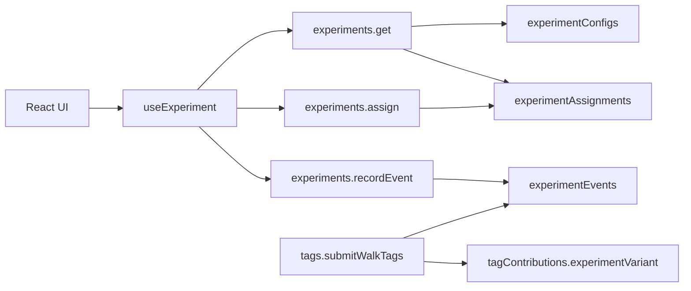

# Feature experiments framework

Reusable A/B/C (or arbitrary variant) assignment for Rambleio. The walk tagging UI is the first consumer; new experiments register in code and opt in via Convex config.

## Architecture



| Table | Purpose |
|-------|---------|
| `experimentConfigs` | Per-experiment enable flag, variant weights, UI config blob |
| `experimentAssignments` | Sticky per-user variant (source of truth) |
| `experimentEvents` | Funnel events (`prompt_shown`, `completed`, `skipped`, …) |

Legacy fields on `users` (`taggingExperimentVariant`, `taggingExperimentAssignedAt`) are kept in sync for walk tagging only; new experiments should not add user columns.

## Adding a new experiment

1. Add a seed entry to `convex/experimentDefinitions.ts` (`EXPERIMENT_SEEDS`).
2. Run admin mutation `experiments.adminSeedDefaults` (or let the first admin config update create the row).
3. Use `useExperiment('your_experiment_key')` in the UI.
4. Call `assign()` before showing variant-specific UI.
5. Record funnel events with `recordEvent('prompt_shown')`, etc.

## Walk tagging experiment

| Key | `walk_tagging_ui` |
| Variants | `A` category browser, `B` smart confirmation, `C` questionnaire |
| Default | **disabled** until enabled in Convex |

### Feature flags

| Control | Effect |
|---------|--------|
| `experimentConfigs.enabled` | Primary on/off for the experiment |
| Env `TAGGING_EXPERIMENTS_ENABLED=false` | Kill switch — disables walk tagging prompts even if DB config is enabled |

Creator route tagging (planner save) is **not** part of this experiment — creators always get the full category browser (Experiment A). Only post-walk capture uses A/B/C.

### API

```ts
// Generic
experiments.get({ key })
experiments.assign({ key })
experiments.recordEvent({ key, eventType, variant?, entityType?, entityId?, metadata? })

// Walk tagging convenience
experiments.getWalkTagging()
tags.getTaggingExperiment()        // deprecated alias
tags.assignTaggingExperiment()     // deprecated alias
tags.recordTaggingEvent({ eventType, ... })
```

### Client hook

```ts
import { useWalkTaggingExperiment } from '@/hooks/use-experiment';
import { EXPERIMENT_EVENTS } from '@/lib/experiments';

const { enabled, variant, config, assign, recordEvent } = useWalkTaggingExperiment();

if (enabled) {
  await assign();
  await recordEvent(EXPERIMENT_EVENTS.promptShown, { variant: variant ?? undefined });
}
```

## Assignment strategy

- **Sticky hash**: `hash(tokenIdentifier + experimentKey)` mapped onto weighted variant buckets.
- **Idempotent**: `assign` returns the existing variant if already assigned.
- **Admin override**: `experiments.adminSetUserVariant` for QA / dogfooding.

## Analytics

### Contribution-level (tagging)

Every `tagContributions` row from walk/follow-session tagging may include `experimentVariant` (A/B/C). Use this for tags-per-submission and confirmation quality by arm.

### Funnel-level (`experimentEvents`)

| Event | When |
|-------|------|
| `prompt_shown` | UI displays the tagging prompt (call from Phase 4 UI) |
| `completed` | User submits tags (`submitWalkTags` / `submitFollowSessionTags`) |
| `skipped` | User dismisses tagging |

Admin summary: `experiments.adminGetSummary({ key: 'walk_tagging_ui' })` — assignment counts by variant, event counts by type.

### Interpreting results

1. **Completion rate** = `completed / (completed + skipped)` per variant (filter `prompt_shown` for show-to-complete if UI records it).
2. **Tags per walk** = average `tagCount` from `completed` event metadata, grouped by `experimentVariant` on contributions.
3. **Creator bias** — exclude `planned_route` creator tagging from walk experiment analysis; creators are always on UI A for route save.
4. **Small N** — hash assignment can skew on low traffic; use `adminGetSummary` assignment counts to check balance.

## Admin operations

| Mutation | Purpose |
|----------|---------|
| `experiments.adminSeedDefaults` | Insert/update configs from code seeds |
| `experiments.adminUpdateConfig` | Enable experiment, change weights, update UI config |
| `experiments.adminSetUserVariant` | Force a user into A, B, or C |
| `experiments.adminGetSummary` | Assignment and event breakdown |

**Pilot checklist**

1. In the Convex dashboard, **Authenticate** with the same account you use in the app (Functions → identity picker).
2. On your row in **Data → users**, set `isAdmin` to `true` (required before any `admin*` mutation).
3. Run `experiments.adminSeedDefaults` (creates `walk_tagging_ui` in `experimentConfigs`).
4. Run `experiments.adminUpdateConfig({ key: 'walk_tagging_ui', enabled: true })`.
5. Optionally set `TAGGING_EXPERIMENTS_ENABLED=true` in Convex deployment env.
6. Use `adminSetUserVariant` to test each UI arm internally.

### Troubleshooting admin mutations

| Error | Cause | Fix |
|-------|--------|-----|
| `Not authenticated` | No identity on the function run | Use **Authenticate** in the Convex dashboard (or run from the signed-in app). |
| `User not found` | Identity exists but no `users` row (rare for admin mutations after deploy) | Run `users.upsertCurrentUser` once, or re-run the admin mutation (auto-creates on mutations). |
| `Admin access required` | User row exists but `isAdmin` is not `true` | Data → users → set `isAdmin: true` on your account. |

## Key files

| Path | Role |
|------|------|
| `convex/experimentCore.ts` | Hash + weighted variant selection |
| `convex/experimentDefinitions.ts` | Experiment seeds and keys |
| `convex/experimentService.ts` | DB operations |
| `convex/experiments.ts` | Public API |
| `src/hooks/use-experiment.ts` | React hook |
| `src/lib/experiments.ts` | Client keys and types |
