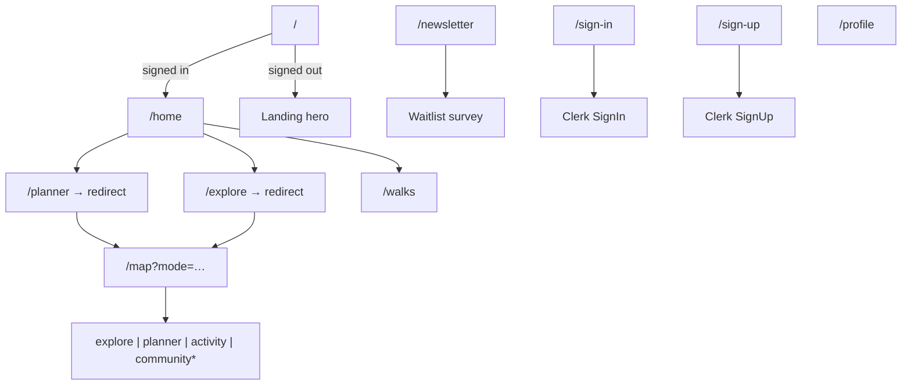

# Webapp sitemap & pages

**Source files:** `src/app/**`, `src/proxy.ts`, `src/app/sitemap.ts`, `src/app/robots.ts`  
**Production URL:** `https://rambleio.com` (see `src/lib/site.ts`)

---

## Overview

The Rambleio webapp is the **marketing gateway** and **signed-in beta companion** for the walking/hiking product. Public visitors see the landing page and newsletter waitlist; authenticated beta testers use a dashboard for route exploration, planning, walk history, and profile settings.

The app is **Next.js 16** (App Router), **Clerk** (auth), **Convex** (backend), and **Mapbox** (maps). Route protection is enforced in `src/proxy.ts` (Clerk middleware).

---

## Site map (routes)

\* `community` appears in the header nav but has no dedicated map overlay yet (see [Map modes](#map-modes)).

---

## Page reference

| Route | Auth | Indexed | Source | Purpose |
|-------|------|---------|--------|---------|
| `/` | Public (redirects to `/home` if signed in) | Yes | `src/app/page.tsx`, `src/app/components/landing-page.tsx` | Marketing landing: hero carousel (Ken Burns JPG slides), closed-beta CTA, nav sign-in/up |
| `/newsletter` | Public | Yes | `src/app/newsletter/page.tsx` | Waitlist signup + walking-habits survey; writes to Convex `waitlist` |
| `/sign-in` | Public | No | `src/app/(auth)/sign-in/[[...sign-in]]/page.tsx` | Clerk sign-in; closed-beta notice; redirects to `/home` |
| `/sign-up` | Public | No | `src/app/(auth)/sign-up/[[...sign-up]]/page.tsx` | Clerk sign-up; invite-only messaging |
| `/home` | Required | No | `src/app/(dashboard)/home/page.tsx` | Beta hub: links to Explore, Plan, Review Walks; changelog |
| `/map` | Required | No | `src/app/(dashboard)/map/page.tsx` → `MapShellClient` | Single Mapbox instance; mode from `?mode=` query param |
| `/planner` | Required | No | `src/app/(dashboard)/planner/page.tsx` | Redirects to `/map?mode=planner` |
| `/explore` | Required | No | `src/app/(dashboard)/explore/page.tsx` | Redirects to `/map?mode=explore` |
| `/walks` | Required | No | `src/app/(dashboard)/walks/page.tsx` | Completed walk list from Convex `walks.listForCurrentUser` |
| `/profile` | Required | No | `src/app/(dashboard)/profile/page.tsx` | Name, weight (for estimates), profile settings |

### Generated / metadata routes

| URL | File | Purpose |
|-----|------|---------|
| `/sitemap.xml` | `src/app/sitemap.ts` | Search engines — public URLs only (`/`, `/newsletter`) |
| `/robots.txt` | `src/app/robots.ts` | Crawl allow/disallow rules |
| `/manifest.webmanifest` | `src/app/manifest.ts` | PWA manifest |
| `/opengraph-image` | `src/app/opengraph-image.tsx` | Default social share image |

SEO configuration is documented in [metadata/README.md](metadata/README.md).

---

## Layout groups

| Group | Path | Layout | Notes |
|-------|------|--------|-------|
| Root | `src/app/layout.tsx` | `Providers` (Clerk + Convex), global metadata | `lang="en"` |
| Auth | `src/app/(auth)/layout.tsx` | Centred card shell | `noindex` metadata |
| Dashboard | `src/app/(dashboard)/layout.tsx` | `DashboardHeader`, `PaceProvider`, `PreviewProvider` | `noindex`; full-screen overlay shell |

---

## Authentication & access

**Middleware:** `src/proxy.ts`

| Rule | Behaviour |
|------|-----------|
| Public routes | `/`, `/sign-in(.*)`, `/sign-up(.*)`, `/newsletter(.*)` |
| `/` + signed in | Redirect to `/home` |
| All other routes | `auth.protect()` — Clerk sign-in required |

Clerk env vars: `.env.local.example`. After sign-in/up, default redirect is `/walks` (Clerk env) but sign-in page uses `forceRedirectUrl="/home"`.

---

## Map modes (`/map`)

The map is a **single persistent shell** (`src/components/map/map-shell.tsx`) driven by the `mode` search param. Viewport is shareable via `?lat=&lng=&zoom=`.

| `?mode=` | Nav label | Overlay | Status |
|----------|-----------|---------|--------|
| `explore` | Explore | `ExploreOverlay` — browse public/community routes | Live |
| `planner` | Planner | `PlannerOverlay` — multi-leg route builder, POIs, elevation | Live |
| `activity` | Activity | `ActivityOverlay` — GPS track review | Live |
| `community` | Community | *(none — falls through)* | Nav placeholder |

**Redirects:** `/explore` → `/map?mode=explore`, `/planner` → `/map?mode=planner`.

**Related components:** `map-shell-client.tsx` (dynamic, no SSR), `explore-overlay.tsx`, `planner-overlay.tsx`, `activity-overlay.tsx`.

---

## Landing page components

| Component | Path | Role |
|-----------|------|------|
| `HeroCarousel` | `src/app/components/hero-carousel.tsx` | JPG slides, Ken Burns motion, crossfade, pause/play + progress pills |
| `HeroCarouselControls` | `src/app/components/hero-carousel-controls.tsx` | Progress indicators and play/pause |
| `hero-ken-burns.ts` | `src/app/components/hero-ken-burns.ts` | Effect library + 10s interval constant |
| `LandingPage` | `src/app/components/landing-page.tsx` | Hero + navbar; closed-beta panel (pointer-events scoped to card) |

Slide assets: `public/slides/Landscape/BG_*.jpg`.

---

## Dashboard header

`src/components/dashboard-header.tsx` — logo → `/home`, centre `NavLinks` (map modes), right: global `ActivityPicker` (pace), notifications placeholder, profile link, app download CTA, Clerk `UserButton`.

Global pace affects time estimates across panels — see [activity-pace.md](activity-pace.md).

---

## Backend (Convex)

Schema and functions live in `webapp/convex/`. Key tables used by the webapp:

| Table / API | Used on |
|-------------|---------|
| `users` | Profile, auth mapping |
| `walks`, `track_points` | `/walks`, activity mode |
| `planned_routes`, `places` | Planner, explore |
| `waitlist` | `/newsletter` |

Run `npx convex dev` from the monorepo root per `AGENTS.md` / `.env.local.example` if schema is shared upstream.

---

## Adding a new page

1. Create `src/app/<route>/page.tsx` (and `layout.tsx` if metadata or shell differs).
2. Update `src/proxy.ts` — public vs protected.
3. If public and indexable: add to `src/app/sitemap.ts` and `src/app/robots.ts` allow list.
4. Add a row to this doc and `docs/index.md`.
5. Update `AGENTS.md` route table if the route is significant for agents.

---

## Future directions

- `/map?mode=community` overlay (nav link exists today).
- Additional public marketing pages (`/about`, pricing) — add to sitemap when live.
- Map canvas comment in dashboard layout references a always-mounted map; today the map mounts only on `/map`.
